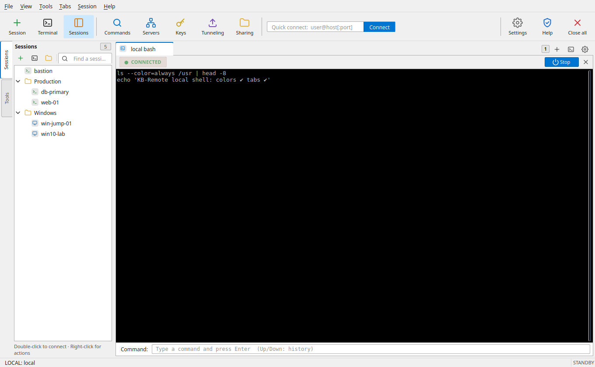
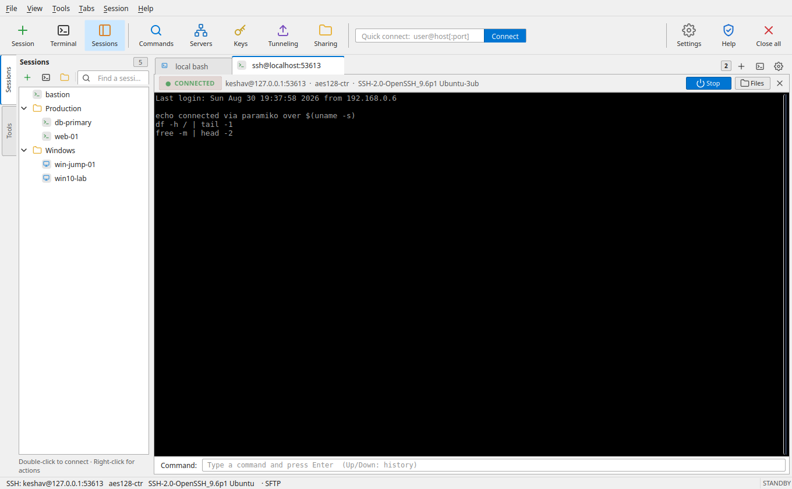
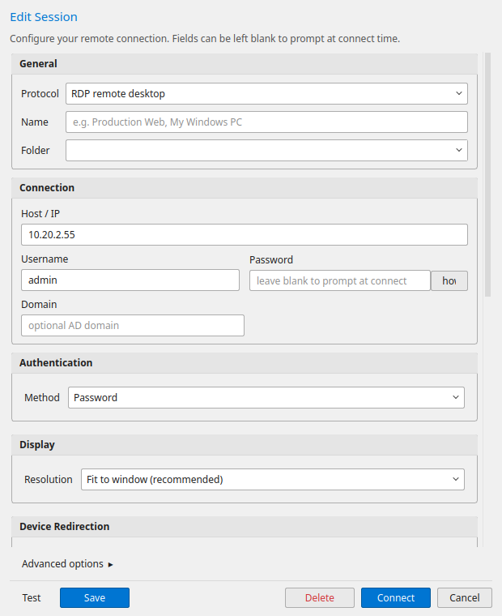
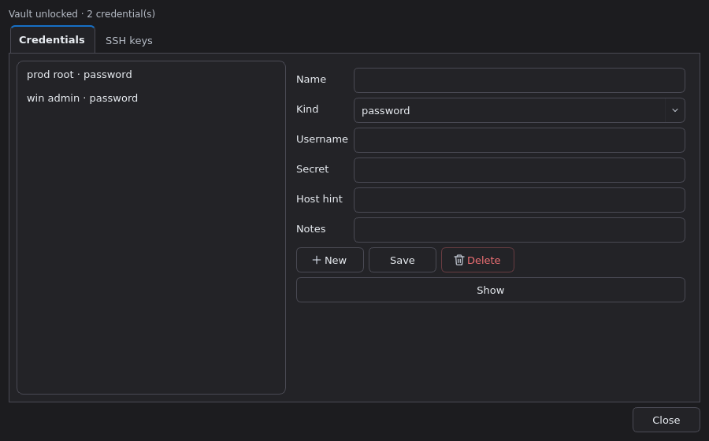
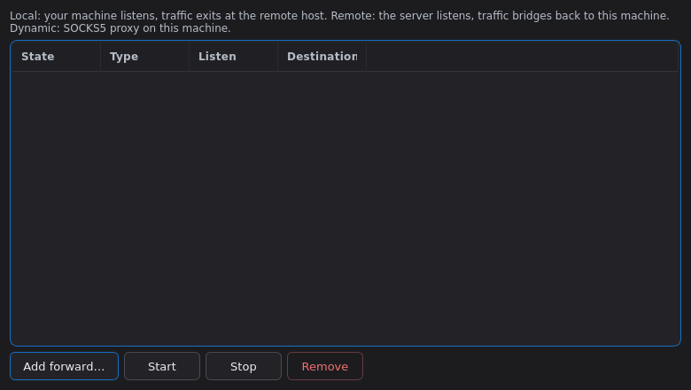
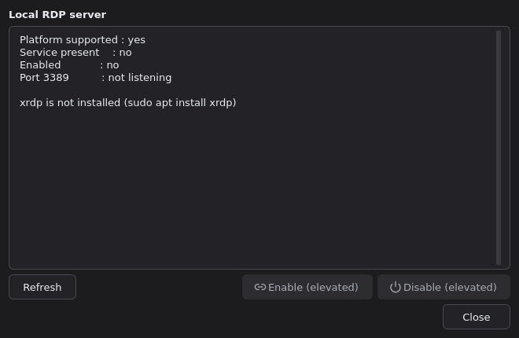
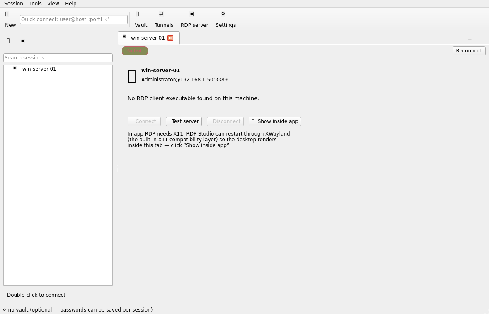
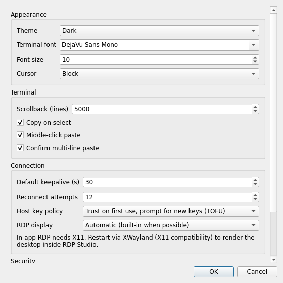

# RDP Studio

**A cross-platform remote-access workbench, inspired by MobaXterm.**
Tabbed SSH sessions to Linux hosts, RDP sessions to Windows hosts, an encrypted
credential vault, SFTP file transfer, port forwarding (including SOCKS), and a
plugin architecture for adding protocols — all in one clean, dark-themed GUI.



| A live SSH tab (real session) | Session editor |
|---|---|
|  |  |

| Credential vault & keys | Port forwarding | RDP server manager |
|---|---|---|
|  |  |  |

---

## Feature overview

| Area | What you get |
|---|---|
| **SSH (Linux)** | Interactive shells in tabs with a real VT emulator (pyte-based: colors, scrollback, mouse-selection, bracketed paste, OSC-52 clipboard), agent/key/password auth, ProxyJump chaining, compression, keepalives |
| **RDP (Windows)** | **Built-in display**: the remote desktop renders *inside the app* (FreeRDP embedded via X11 `/parent-window` — no separate window, like MobaXterm) on Linux — **including Wayland desktops**, where RDP Studio restarts itself through XWayland automatically when an RDP session is in play; mstsc/FreeRDP external window on Windows or as a fallback. Saved settings, **fit display to screen** (smart sizing), fullscreen, drive/clipboard redirection, RD-gateway; **protocol-level server probes** (X.224 negotiation) to verify reachability + negotiated security; local RDP **server** status/enable/disable |
| **Local terminal** | One-click native shell in a tab (toolbar, `Session → New local terminal`, `Ctrl+Shift+T`): real PTY on Linux/macOS, ConPTY on Windows — colors, resize, `vim`/`top` all work |
| **Command palette** | Instant keyboard launcher (`Ctrl+P` / `Ctrl+K`): fuzzy-search and switch across open tabs, connect saved sessions, and launch any tool or command |
| **In-terminal search** | Floating search overlay (`Ctrl+F` / `F3` / `Shift+F3`): case-sensitive search, visual match highlight rectangles on screen, match count indicator, and match navigation |
| **Command snippets** | Collapsible macros & snippets drawer (`Ctrl+Shift+S`): categorized system admin, docker, networking, logs, and process presets with 1-click execution and placeholder variable rendering (`$HOST`, `$USER`, `$SELECTION`) |
| **Broadcast mode** | Multi-execution mode (`Ctrl+Shift+B`): mirrors typing in the active terminal to all open SSH and local terminal tabs simultaneously |
| **Network diagnostics** | Standalone & workbench tool (`Ctrl+Shift+N`): multi-threaded TCP port scanner, TCP ping latency tester with jitter and loss stats, and forward/reverse DNS lookup |
| **Multi-host runner** | Parallel cluster execution (`Ctrl+Shift+X`): execute commands across multiple SSH hosts concurrently with a consolidated results grid and stdout/stderr inspector |
| **SSH key utility** | Standalone key tool (`Ctrl+Shift+U`): key generation (Ed25519/RSA/ECDSA), visual Randomart (Drunken Bishop algorithm), and OpenSSH ⇄ PuTTY `.ppk` converter |
| **Remote monitoring** | Live CPU, memory, swap, disk, load average, logged-in users and network throughput for any SSH host, with sparkline history and a selectable refresh rate (`Ctrl+Shift+M`). Runs a single read-only `/proc` probe per sample over the session's existing SSH transport — no agent to install |
| **File transfer & edit** | Dual-pane SFTP browser (remote ⇄ local), recursive uploads/downloads with progress + cancel, context menus, hidden files toggle (`.*`), and **in-app text file editor** with direct SFTP save-and-upload (`Ctrl+S`) |
| **Session manager** | Grouped, searchable sidebar of saved sessions; quick connect (`user@host[:port]`, port 3389 ⇒ RDP); duplicate/import/export; import from `~/.ssh/config` |
| **Tab management** | Right-click tab context menu (Close, Close Others, Close to the Right, Duplicate, Rename, Reconnect, Session Logging), shortcuts (`Ctrl+W`, `Ctrl+Tab`, `Ctrl+1..9`) |
| **Simple by default** | The session editor asks for **host, username and password** — everything else (ports, tags, jump hosts, keepalives, forwards, RD gateway, certificates) lives behind a single **Advanced options** toggle. RDP display is one dropdown: fit to window, fullscreen, or a standard resolution |
| **Credentials** | Simple path: type a **username + password** per session (stored in the sessions file, `0600` — no vault required). Power path: AES-256-GCM encrypted vault under a master passphrase (PBKDF2-SHA256, 310k iterations default), auto-lock, redacted logging; SSH key generation (Ed25519/ECDSA/RSA) with passphrases stored in the vault |
| **Port forwarding** | Local, remote and **dynamic (SOCKS5)** tunnels per session, runtime start/stop, forward events surfaced in the UI |
| **Reconnect** | Exponential backoff + jitter, attempt limits, live status chips; FreeRDP `+auto-reconnect` for RDP |
| **Clipboard & logging** | Copy-on-select, middle-click paste, Ctrl+Shift+C/V, multi-line paste confirmation, OSC-52 (`\x1b]52`) support, RDP clipboard redirection; live session output logging to file (`● REC`) |
| **Security** | TOFU host-key verification with loud changed-key warnings (own `known_hosts`), vault secrets never in session store (a plain password is only written if you explicitly save it), passwords never exported, atomic encrypted vault writes (0600) |
| **Extensible** | Every protocol is a plugin; third parties register protocols via the `rdpstudio.protocols` entry point (see [docs/PROTOCOLS.md](docs/PROTOCOLS.md)) |

Runs on **Linux and Windows** (and the codebase is macOS-friendly), Python ≥ 3.10, Qt 6.

## Install

### Linux

```bash
# from a checkout
./install.sh                 # venv + pip install . + launcher + .desktop

# or from PyPI-style source
pipx install .               # or: pip install --user rdp-studio
rdpstudio
```

For RDP you'll want FreeRDP: `sudo apt install freerdp3-x11` (or `freerdp2-x11`).
FreeRDP powers both the **built-in display** (the desktop renders inside the
app) and the external-window mode. Make sure to install the **`-x11` flavour**
(`xfreerdp`); the SDL client (`sdl-freerdp`) cannot embed and is only used for
external windows.

**Wayland desktops** (Ubuntu 25.04+/26.04, Fedora, …): the built-in display
needs X11 window embedding, so RDP Studio transparently restarts itself
through **XWayland** (the X11 compatibility layer that ships with your
desktop) whenever it opens an RDP session — nothing to configure. Prefer the
native Wayland window instead? Set *Settings → Connection → RDP display* to
**External**, or force it per run with `QT_QPA_PLATFORM=wayland rdpstudio`.

### Windows

```powershell
powershell -ExecutionPolicy Bypass -File install.ps1
rdpstudio
```

RDP uses the built-in `mstsc.exe`. The optional `pywinpty` extra gives local
ConPTY shells: `pip install rdp-studio[win]`.

See [docs/INSTALL.md](docs/INSTALL.md) for details, PyInstaller builds
(`packaging/rdpstudio.spec`), and the Inno Setup installer
(`packaging/windows/RDPStudio.iss`).

## Quick start

1. Launch `rdpstudio`.
2. **Session → New session** (Ctrl+N) → pick *SSH terminal* or *RDP remote
   desktop* → fill **Host**, **Username** and **Password** → *Save*. No vault
   needed — the password is stored with the session (leave it empty and you'll
   be asked at connect time). For RDP, tick **Fit display to screen** to scale
   the remote desktop to the window.
3. Double-click the session in the sidebar. Use **Files** / **Tunnels** on the
   tab header for SFTP and port forwarding.
4. Or just type `root@10.0.0.9:2222` into the quick-connect box and hit ⏎.
5. *(Optional)* **Tools → Credential vault** (Ctrl+Shift+K) → keep passwords in
   an encrypted vault instead of the session file.

## Scope note on RDP

RDP rendering is delegated to FreeRDP / `mstsc` — the same approach used by
Remmina and mRemoteNG — because no licenseable embeddable RDP *renderer*
exists. On Linux, RDP Studio runs FreeRDP in **built-in mode** so the remote
desktop appears *inside the app* (FreeRDP's X11 window is embedded into the
tab via `/parent-window`; keyboard/mouse are handled by FreeRDP). On
**Wayland** desktops the app restarts itself through **XWayland**
automatically when an RDP session is in play, so the in-tab desktop works
there too (exactly like MobaXterm on Windows). On Windows, or when built-in
mode isn't available (no XWayland, no FreeRDP), the session opens in the
platform's normal RDP window and the tab monitors it. Either way RDP
Studio adds protocol-level *RDP server probing* (real X.224/TPKT negotiation
in pure Python), session settings management, gateway support,
auto-reconnect, and local server enable/disable. See
[docs/ARCHITECTURE.md](docs/ARCHITECTURE.md) for the roadmap toward a fully
in-process renderer.

| RDP tab on a Wayland desktop (before the one-click XWayland restart) | Settings → Connection |
|---|---|
|  |  |

## Development

```bash
python3 -m venv .venv && . .venv/bin/activate
pip install -e ".[dev]"
pytest                # includes live end-to-end tests against a local sshd
ruff check src tests
python scripts/dev_screenshots.py docs/screenshots   # offscreen GUI captures
```

The test-suite spins up a throwaway `sshd` (key auth + SFTP subsystem) and
exercises the *real* worker, tunnels (local + SOCKS5), TOFU host-key flow and
SFTP round-trips — skipped automatically if no `sshd` is available.

## Documentation

- [docs/ARCHITECTURE.md](docs/ARCHITECTURE.md) — layers, threading model, data flow
- [docs/PROTOCOLS.md](docs/PROTOCOLS.md) — writing protocol plugins
- [docs/SECURITY.md](docs/SECURITY.md) — threat model, vault design, host-key policy
- [docs/INSTALL.md](docs/INSTALL.md) — per-OS install, packaging, CI builds

## License

MIT (see [LICENSE](LICENSE)).
